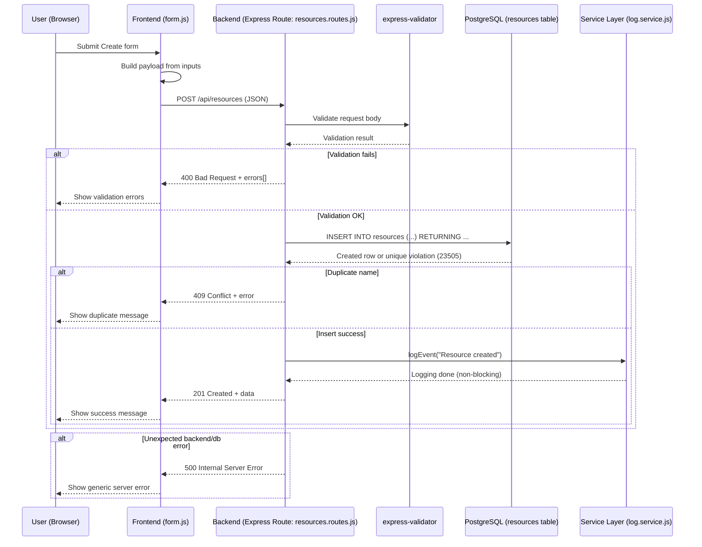
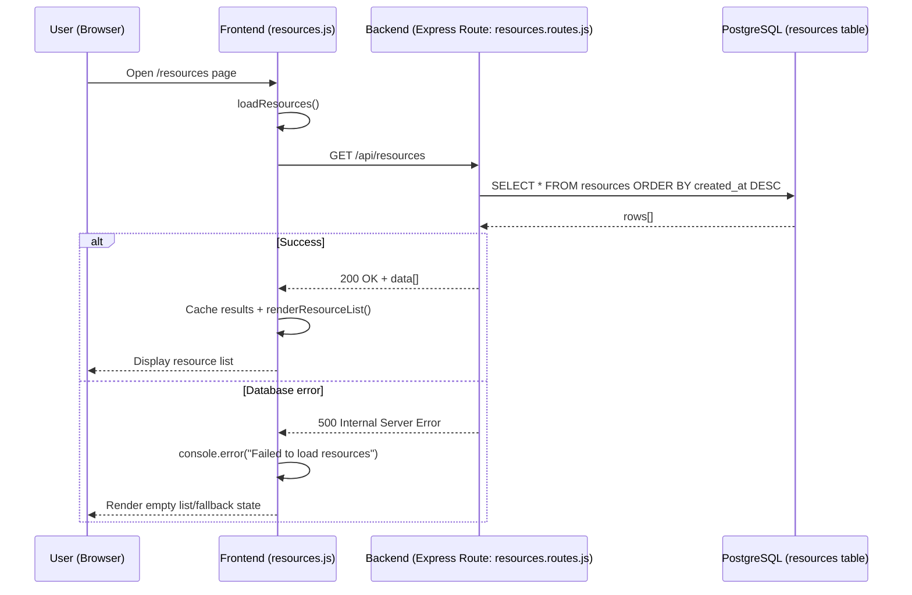
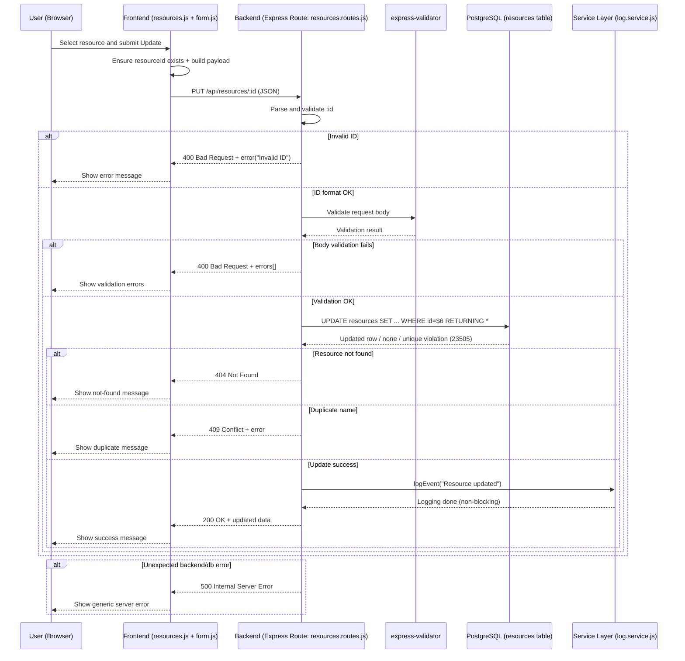
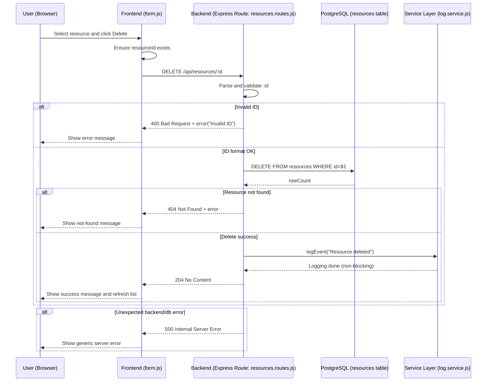

# Booking System Phase6 CRUD Data Flow

This file models the Phase6 CRUD operations using the same sequence-diagram style as the provided CREATE example.

Runtime verification performed on local Phase6 deployment (`docker compose up -d`) at `http://localhost:5000` with API checks from the running app behavior and endpoint calls.

## 1) CREATE - Resource

## 2) READ - Resource List

## 3) UPDATE - Resource

## 4) DELETE - Resource

## Quick verification notes (Phase6)

Observed endpoint behavior while Phase6 was running:

- `POST /api/resources` -> `201` on success, `400` with `errors[]` on validation failure, `409` on duplicate resource name.
- `GET /api/resources` -> `200` with `data[]`.
- `PUT /api/resources/:id` -> `200` on success, `400` (invalid ID or validation errors), `404` when ID does not exist, `409` on duplicate name.
- `DELETE /api/resources/:id` -> `204` on success, `400` for invalid ID, `404` when ID does not exist.
